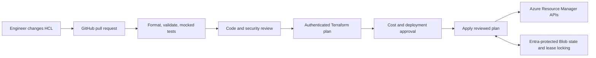
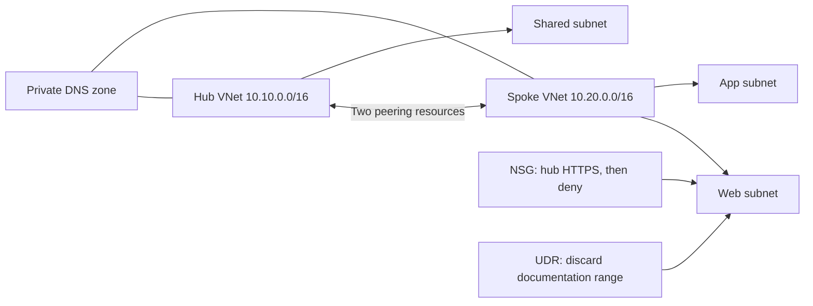
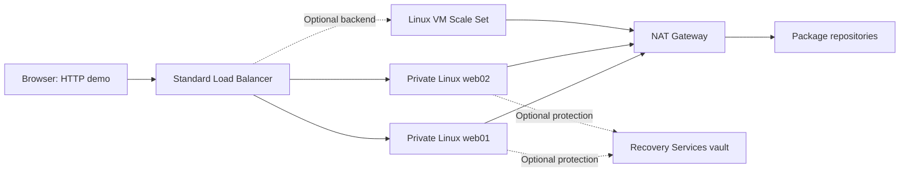
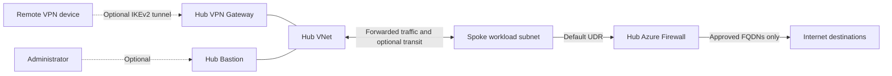
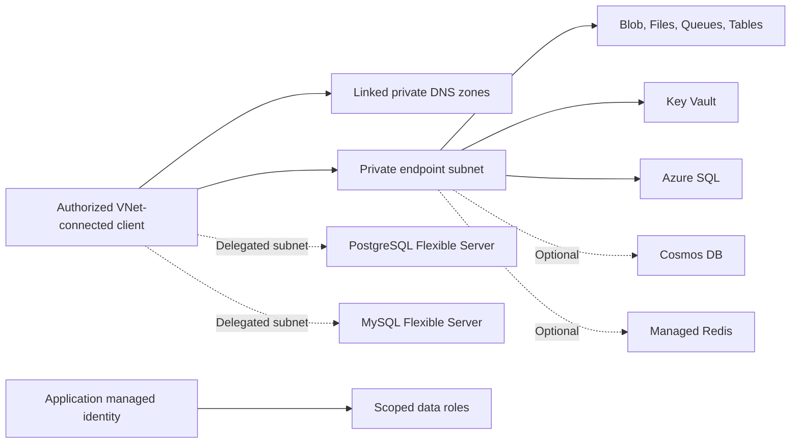
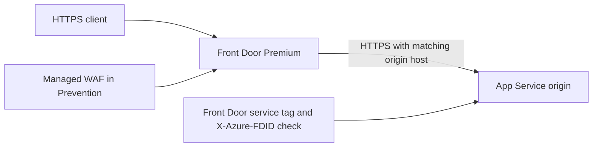
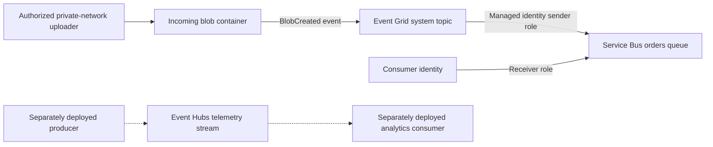

# Architecture and Dependency Flows

These diagrams correspond to individual examples. They are not a claim that applying every directory creates one integrated production platform. GitHub renders the Mermaid blocks directly.

## Terraform Delivery Flow

The included GitHub workflow implements the credential-free checks. The authenticated plan and approval/apply stages are shown as a production delivery pattern, not as an enabled deployment workflow. Terraform state and the provider dependency lock file serve different purposes.

## Network Foundation: Example 01

The web NSG permits the demonstrated HTTPS path and denies other inbound traffic, overriding broad default VNet rules on that subnet. The app subnet is only a topology example, not a complete tier-segmentation policy. Peering is bidirectional but not transitive. No Internet gateway, VM or firewall is hidden in this lab.

## Compute: Example 02

NSG rules allow the web port and the Azure load-balancer health probe. No public SSH/RDP rule is created. NAT provides explicit egress for cloud-init and patch downloads; a load-balancer inbound rule is not treated as an outbound design. HTTP is intentionally limited to non-sensitive sample content.

## Secure Hub: Example 03

The firewall is actually created before its IP is used as the UDR next hop. Reserved appliance subnets retain their Azure-required names. The spoke NSG permits administration from the Bastion subnet; no workload VM is included in this topology-only lab. VPN transit is enabled only when the hub gateway exists. A remote gateway and its route configuration are outside Terraform's Azure resources.

## Private Data: Example 04

Network reachability and authorization are separate. A private endpoint does not grant access, and an RBAC role does not provide a network route. PostgreSQL and MySQL use dedicated delegated subnets in this design, not private endpoints. The example creates the data network but not a laptop VPN or jump VM.

## Web Delivery: Example 07

Application Gateway and Traffic Manager are independent optional comparisons, not extra hops automatically inserted into this path. Front Door proxies HTTP traffic; Traffic Manager returns DNS answers; a Standard Load Balancer forwards layer-4 traffic.

## Events: Example 08

Event Grid delivers event notifications; it does not copy the blob contents into the queue. The Event Hubs path is a separate streaming example. Producers and consumers must implement retries, idempotency, checkpointing and poison-message handling as appropriate.

## Analytics and AI

Example 09 grants Data Factory, Synapse and the Databricks access connector scoped lake access. Managed private endpoint requests need approval on the storage account. Synapse managed endpoints use a private data-plane API and are configured only after the runner can reach the workspace Dev endpoint.

Example 10 shows private AI service endpoints and workload identities. It does not automatically create Search indexes, connect embeddings to Search, deploy an application, or train a model. Private inbound access also does not complete the Machine Learning managed outbound network.

## State Boundaries

Use a distinct backend key for each environment and example, such as `demo/04-data-services.tfstate`. Keep state infrastructure separate from workloads. A production composition can reuse these module contracts, but shared networking and cross-state dependencies require explicit ownership, lifecycle and access decisions.